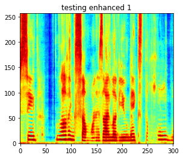
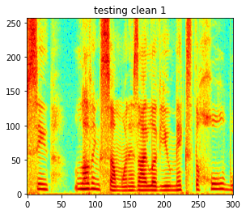
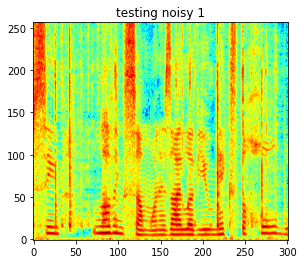
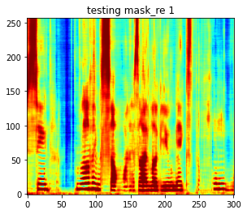
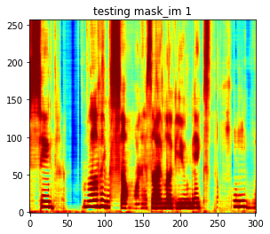

# Spectrogram-Masking-based-Neural-Network-model-for-single-channel-Speech-Enhancement
Implementation(unofficial) is based on models proposed by Google Audio team: [Exploring Tradeoffs in Models for Low-latency Speech Enhancement](https://arxiv.org/abs/1811.07030)

---

## Dependencies
- python 3.9.7
- tensorflow 2.6.0
- keras 2.6.0

---

## Dataset
- **Clean speech:** This project uses clean speech from [Librispeech](https://www.openslr.org/12/). To reproduce the results, download 'train-clean-360.tar.gz' and 'test-clean.tar.gz ' from Librispeech. Unzip the training clean files to "./data/clean/clean_train/" and unzip the testing clean files to "./data/clean/clean_test/". 
- **Noise:** The noise sounds are obtained from [Microsoft Scalable Noisy Speech Dataset (MS-SNSD)](https://github.com/microsoft/MS-SNSD). Download the noise_train and noise_test folder from [Microsoft Scalable Noisy Speech Dataset (MS-SNSD)](https://github.com/microsoft/MS-SNSD) and put them under "./data/noise/noise_train" and "./data/noise/noise_test".
- **Use sounds from other sources:** Put your training and testing clean speech files(.wav or .flac) under "./data/clean/clean_train/" and "./data/clean/clean_test/" correspondingly. 
Put your training and testing noise files(.wav or .flac) under "./data/noise/noise_train/" and "./data/noise/noise_test/" correspondingly. 

---

## Prepare data
The noisy sounds are synthesized by adding the clean speech and noise at a certain SNR level. Before synthesizing, all sounds will be resampled at the sampling rate specified in "./data/config.ini"

- Open the config.ini file under "./data/". 
- Configure your data path.
- **sample_rate**: all the sounds files will be resampled at this sample rate.
- **file_length**: The length of your training and testing sound files in seconds, default is 3s.
- **total_training_files**: total number of training files that will be synthesized.
- **total_testing_files**: total number of testing files that will be synthesized.
- **SNR_lower**: The lower bound of your SNR level
- **SNR_lower**: The upper bound of your SNR level
- **total_snrlevels**: Number of SNR levels between the lower bound and upper bound

After configuration, run "./data/data_prep.py", 6 folders will be created under "./data/":
- **CleanSpeech_training**: All the normalized clean speech training files used for synthesizing the noisy sounds, which will be used to evaluate the SNRi and SDR performance of the model. Name of each sound file has the form :  "clnsp***n***.wav"
- **CleanSpeech_testing**: All the normalized clean speech testing files used for synthesizing the noisy sounds, which will be used to evaluate the SNRi and SDR performance of the model. Name of each sound file has the form :  "clnsp***n***.wav"
- **Noise_training**: All the normalized noise speech training files used for synthesizing the noisy sounds, which will be used to evaluate the SNRi and SDR performance of the model. Name of each sound file has the form :  "noisy***n***_SNRdb _***snr_level***.wav"
- **Noise_testing**: All the normalized noise speech testing files used for synthesizing the noisy sounds, which will be used to evaluate the SNRi and SDR performance of the model. Name of each sound file has the form :  "noisy***n***_SNRdb _***snr_level***.wav"
- **NoisySpeech_training**: All the noisy speech training files synthesized. Name of each sound file has the form :  "noisy***n***_SNRdb _***snr_level*** _clnsp***n***.wav"
- **NoisySpeech_testing**: All the noisy speech training files synthesized. Name of each sound file has the form :  "noisy***n***_SNRdb _***snr_level*** _clnsp***n***.wav"

---

## STFT
In order to speed up training, the STFT of all training and testing sound files are calculated a proir. Edit "config.ini" in the main directory to configure your STFT settings. According to the paper, a hann window with 25ms window length and 10ms hop size is used, number of frequency bins is set to 512.

Run "STFT.py", two folders named **Training_STFT** and **Testing_STFT** will be created under the main directory.

## Train
Run "train.py" will train the model. Model parameters are saved in "cp". If you want to resume training from last checkpoint, modify the last line of "train.py", change it as
```
trainer.train(from_checkpoint=True,save_weights = True).
```
Training and testing results will be saved every each epoch, you can use tensorboard to visualize the results.
```
python -m tensorboard.main --logdir=*your_dir*\logs\gradient_tape
```
The enhanced testing files are saved under "./enhanced" 

---

## System architecture
**Delta phase is not used in this implementation because I haven't figured out the correct way to implement it**.


---

## Result
- Trained on an NVIDIA RTX 3080 GPU for 24 hours.
### SDR
|    Metric   |  value  |
|-------------|---------|
| AVG SDR     | 11.65db |
| AVG SNRi    | 9.96db  |


### Spectrogram Example 






### Sound Examples
-sound 1

https://user-images.githubusercontent.com/43918015/157794941-4a0272f1-d308-406b-a8b5-c6cdc4526442.mp4

https://user-images.githubusercontent.com/43918015/157795161-aaf57f3e-5501-42f6-9ac4-57e7e8597959.mp4

https://user-images.githubusercontent.com/43918015/157795401-62e3c8f6-7770-4441-be26-2d9cd26111c0.mp4

-sound 2

https://user-images.githubusercontent.com/43918015/157796082-4bd4b1f7-39b8-4fb5-a969-5c2d9fd94940.mp4

https://user-images.githubusercontent.com/43918015/157796110-f13fdd23-8730-4be7-83e3-117ed6735182.mp4

https://user-images.githubusercontent.com/43918015/157796130-1c5f78ec-4f07-4ff7-9956-6e0eaa12cec4.mp4

